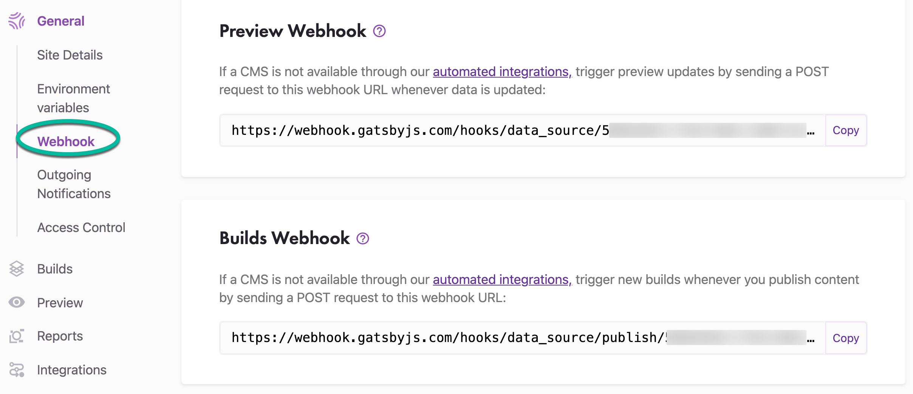

# Gatsby + ButterCMS Starter Project

This Gatsby starter project fully integrates with dynamic sample content from your ButterCMS account, including main menu, pages, blog posts, categories, and tags, all with a beautiful, custom theme with already-implemented search functionality. All of the included sample content is automatically created in your account dashboard when you sign up for a free trial of ButterCMS.

Live Demo: https://gatsbyappliftingmasteroriginal.gatsbyjs.io/

[](https://vercel.com/new/clone?repository-url=https%3A%2F%2Fgithub.com%2FButterCMS%2Fgatsby-applifting&env=BUTTER_CMS_API_KEY&envDescription=Your%20ButterCMS%20API%20Token&envLink=https%3A%2F%2Fbuttercms.com%2Fsettings%2F&project-name=gatsby-starter-buttercms&repo-name=gatsby-applifting&redirect-url=https%3A%2F%2Fbuttercms.com%2Fonboarding%2Fvercel-starter-deploy-callback%2F&production-deploy-hook=Deploy%20Triggered%20from%20ButterCMS&demo-title=ButterCMS%20Gatsby%20Starter&demo-description=Fully%20integrated%20with%20your%20ButterCMS%20account&demo-url=https%3A%2F%2Fgatsby-applifting.vercel.app%2F&demo-image=https://cdn.buttercms.com/r0tGK8xFRti2iRKBJ0eY&repository-name=gatsby-applifting)

[Deploy with Gatsby Cloud](https://www.gatsbyjs.com/dashboard/deploynow?url=https://github.com/ButterCMS/gatsby-applifting)

## 1. Installation

First, clone the repo and install the dependencies by running `npm install`

```bash
git clone git@github.com:ButterCMS/gatsby-applifting.git gatsby-starter-buttercms
cd gatsby-starter-buttercms
npm install
```

### 2. Set API Token

To fetch your ButterCMS content, add your API token as an environment variable.

```bash
$ echo 'BUTTER_CMS_API_KEY=<Your API Token>' >> .env
```

### 3. Run local server

To view the app in the browser, you'll need to run the local development server:

```bash
npm run develop
```

Congratulations! Your starter project is now live at [http://localhost:8000/](http://localhost:8000/).

## 4. Deploy on Gatsby Cloud

Deploy your Gatsby app using Gatsby Cloud. With this guide, you'll create a copy of your starter project in your Git provider account, instantly deploy it, and institute a full content workflow connected to your ButterCMS account. Smooth.

[Deploy with Gatsby Cloud](https://www.gatsbyjs.com/dashboard/deploynow?url=https://github.com/ButterCMS/gatsby-applifting)

1. If you do not have an account, [join ButterCMS](https://buttercms.com/join/)
2. Fork this repository
3. Sign up on [Gatsby Cloud](https://www.gatsbyjs.com/dashboard/signup/)
4. Follow guide [Build your site with Gatsby Cloud](https://www.gatsbyjs.com/docs/tutorial/part-1/#build-your-site-with-gatsby-cloud)

⚠️ **Don't forget to set the BUTTER_CMS_API_KEY environment variable in Gatsby Cloud.**

### Configure Webhooks

Webhooks are a powerful feature that allow you to notify your internal systems whenever content in ButterCMS has changed. Your host platform needs to be notified so that Gatsby can create fresh pages from the new data.

1. Go to [Gatsby Cloud Dashboard](https://www.gatsbyjs.com/dashboard)
2. Select your Gatsby project
3. Go to Site Settings
3. Copy your Preview webhook URL or Build webhook URL



5. Configure ButterCMS webhook on https://buttercms.com/webhooks/


Read more about webhooks:

- [Gatsby Cloud Webhooks](./docs/gatsby-cloud-webhooks.png)
- [Gatsbyjs.com: Sourcing from ButterCMS](https://www.gatsbyjs.com/docs/sourcing-from-buttercms/#webhooks)

## 5. Deploy on Vercel

Deploy your Gatsby app using Vercel, the creators of Next.js. With the click of a button, you'll create a copy of your starter project in your Git provider account, instantly deploy it, and institute a full content workflow connected to your ButterCMS account. Smooth.

[](https://vercel.com/new/clone?repository-url=https%3A%2F%2Fgithub.com%2FButterCMS%2Fgatsby-applifting&env=BUTTER_CMS_API_KEY&envDescription=Your%20ButterCMS%20API%20Token&envLink=https%3A%2F%2Fbuttercms.com%2Fsettings%2F&project-name=gatsby-starter-buttercms&repo-name=gatsby-applifting&redirect-url=https%3A%2F%2Fbuttercms.com%2Fonboarding%2Fvercel-starter-deploy-callback%2F&production-deploy-hook=Deploy%20Triggered%20from%20ButterCMS&demo-title=ButterCMS%20Gatsby%20Starter&demo-description=Fully%20integrated%20with%20your%20ButterCMS%20account&demo-url=https%3A%2F%2Fgatsby-applifting.vercel.app%2F&demo-image=https://cdn.buttercms.com/r0tGK8xFRti2iRKBJ0eY&repository-name=gatsby-applifting)

## 6. Previewing Draft Changes

By default, your starter project is set up to allow previewing of draft changes saved in your ButterCMS.com account. To disable this functionality, set the following value in your .env file: BUTTER_CMS_PREVIEW=false
